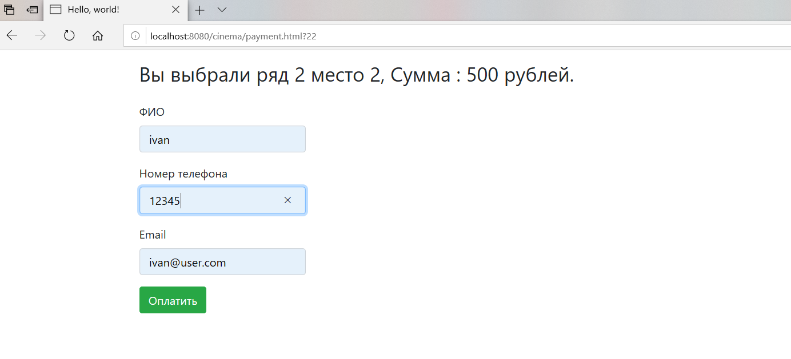
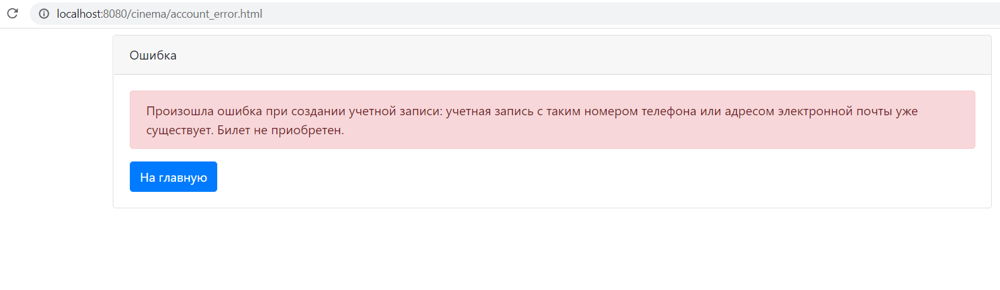
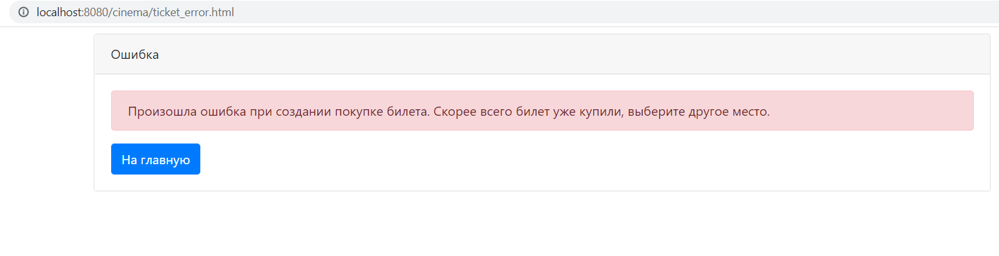

### Project Cinema service

#### Description

This is an application for ordering cinema tickets.
The user can see the occupied places,
choose and book free. 
Это приложение для заказа билетов в кинотеатре.
Пользователь может видеть занятые места, 
выбрать и забронировать свободные.

#### Обзор

Главная страница.

Страница бронирования.

Ошибка создания учетной записи.

Ошибка бронированиня билета.

#### Настройка и сборка

У приложения есть один файл конфигурации: /src/main/resources/db.properties,

в котором необходимо указать настройки соединения с сервером баз данных.

Сборка осуществляется командой: mvn package.

После сборки приложение нужно развернуть в контейнере сервлетов и настроить сервер баз данных.